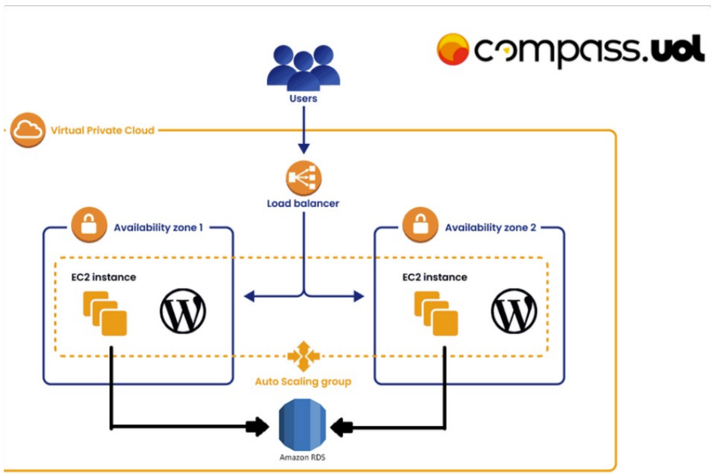
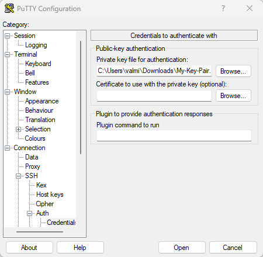

<h1 align="center">AWS_Docker</h1>
<h1 align="center">Atividade AWS - Docker Unicesumar-Ufopa</h1>

[](https://github.com/ValmirSGama/AWS_Docker/blob/main/LICENSE) 


## Descrição:   
**1º** instalação e configuração do
DOCKER ou CONTAINERD no host
EC2;

* Ponto adicional para o trabalho utilizar
a instalação via script de Start
Instance (user_data.sh)

**2º** Efetuar Deploy de uma
aplicação Wordpress com:
container de aplicação
RDS database Mysql

**3º** configuração da utilização do serviço
EFS AWS para estáticos do container
de aplicação Wordpress

**4º** configuração do serviço de
Load Balancer AWS para a
aplicação Wordpress

* **Pontos de atenção:**
  * não utilizar ip público para saída
do serviços WP (Evitem publicar o
serviço WP via IP Público)

  * pastas públicas e estáticos do
wordpress sugestão de utilizar
o
EFS (Elastic File Sistem)
Fica a critério de cada
integrante (ou dupla) usar
Dockerfile ou
Dockercompose;

  * Necessário demonstrar a
aplicação wordpress funcionando
(tela de
login)

  * Aplicação Wordpress precisa
estar rodando na porta 80 ou
8080;

  * Utilizar repositório git para
versionamento;
Criar documentação.

#### TOPOLOGIA.


- Busque por VPC, no campo de pesquisa do console AWS.
- Ligeiramente abaixo do campo de pesquisa, click em **Create VPC**.
- Vamos criar a topologia por uma opção mais ágil. Em VPC settings, selecione: **VPC and more**.
- Ao concluir a configuração por essa escolha, teremos criado e associado as principais estruturas da topologia, como por exemplo: a Subnet, Route table e Internet gateway.
- Em Auto-generate, receberá o nome da VPC. O mesmo refletirá na nomeação das principais estruturas da topologia citado no paragrafo anterior.
- Em Number of Availability Zones (Azs), escolhi: (2).
- Para Number of public subnets. Escolhi: (2).
- Para Number of private subnets. Escolhi: (0).
- Para NAT gateways. Escolhi: (None).
- Para VPC endpoints. Escolhi: (None).
- As demais configurações permaneceram o padrão.
- Finalizando, click em “Create VPC”, em seguida teremos:

**Segue o Resouce map da topologia.**


 #### Criando credenciais de segurança para acesso ao ambiente. 🔑
- Busque por EC2, no campo de pesquisa do console AWS.
- Role a lateral esquerda até a parte de **Network & Security**, click em **Key Pairs**.
- Create Key pair.
- Dê um nome de sua escolha à chave.
- Selecionei o formato **.ppk**, pois a utilizei no windows via Putty.
- Clique em **Create Key Pair**para finalizar.

#### Criação dos Security Groups. 🔐
- No console AWS entre pesquise por **EC2**.
- No menu lateral esquerdo, na seção de Network & Security, selecione **Security Groups**.
- Dentro de Security Groups, clique no botão Create **security group**.
- Crie e configure os seguintes security groups usando a VPC criada anteriormente:

- #### Load Balancer - Inbound rules


- #### EC2 Web Server - Inbound rules


- #### RDS - Inbound rules


- #### EFS - Inbound rules


#### Criação do Launch Template para a EC2. 🎯
- Acesse No console AWS, pesquise por **EC2**.
- No menu lateral esquerdo, na seção **Instances** selecione **Launch Templates**.
- Dentro de **Launch Templates** clique em **Create launch template**.
- No campo **Launch template name** dê um nome de sua escolha.
- No campo **Template version description** dê uma descrição de sua escolha.
- Em **Application and OS Images** cliquei em **Quick Start**, depois clique em **Amazon Linux** selecionei o Amazon Linux 2 AMI.
- Na seção **Instance type** selecionei o tipo t3.small.
- No campo **Key pair name** selecionei a key pair criada anteriormente.
- Em **Network settings**, no campo **Security groups** selecionei o grupo "EC2 Web Server" que foi criado anteriormente.
- Em **Resource tags**, adicionei as tag requeridas ao projeto.
- Em **Storage** e **Size**, adicionei 20 de GIB.
- Em **Advanced details**, no campo **User data** adicionei o script abaixo:

```
#!/bin/bash
#Atualizar os pacotes do sistema
sudo yum update -y

#Instalar, iniciar e configurar a inicialização automática do docker
sudo amazon-linux-extras install docker 
sudo service docker start
sudo systemctl enable docker

#Adicionar o usuário ec2-user ao grupo docker
sudo usermod -a -G docker ec2-user

#Instalação do docker-compose
sudo curl -L "https://github.com/docker/compose/releases/latest/download/docker-compose-$(uname -s)-$(uname -m)" -o /usr/local/bin/docker-compose
sudo chmod +x /usr/local/bin/docker-compose

#Instalar o pacote do nfs-utils
sudo yum install nfs-utils -y

#Criar a pasta onde o EFS vai ser montado
sudo mkdir /mnt/efs

#Montagem e configuração da montagem automática do EFS
sudo mount -t nfs4 -o nfsvers=4.1,rsize=1048576,wsize=1048576,hard,timeo=600,retrans=2,noresvport fs-05e08e7c298f2acbc.efs.us-east-1.amazonaws.com:/ /mnt/efs
sudo echo "fs-05e08e7c298f2acbc.efs.us-east-1.amazonaws.com:/ /mnt/efs nfs4 nfsvers=4.1,rsize=1048576,wsize=1048576,hard,timeo=600,retrans=2,noresvport" >> /etc/fstab

# Criar uma pasta para os arquivos do WordPress
sudo mkdir /mnt/efs/wordpress

# Criar um arquivo docker-compose.yml para configurar o WordPress
sudo cat <<EOL > /mnt/efs/docker-compose.yml
version: '3.8'
services:
  wordpress:
    image: wordpress:latest
    container_name: wordpress
    ports:
      - "80:80"
    restart: always
    environment:
      WORDPRESS_DB_HOST: RDS-Endpoint
      WORDPRESS_DB_USER: RDS-Master username
      WORDPRESS_DB_PASSWORD: RDS-Master password
      WORDPRESS_DB_NAME: RDS-Initial database name
      WORDPRESS_TABLE_CONFIG: wp_
    volumes:
      - /mnt/efs/wordpress:/var/www/html
EOL

# Inicializar o WordPress com docker-compose
docker-compose -f /mnt/efs/docker-compose.yml up -d
```

#### Criação do Auto Scaling group. 📈
- No console AWS, entre no serviço **EC2**.
- No menu lateral esquerdo, na seção de **Auto Scaling** selecionei **Auto Scaling Groups**.
- Dentro de **Auto Scaling groups**, clique no botão **Create Auto Scaling group**.
- Execute a seguinte configuração:
    - #### Step 1 - Choose launch template:
        - No campo **Auto Scaling group name**, nomeie a sua escolha.
        - Na seção **Launch template**, selecione o template criado anteriormente.
        - Cliquei em **Next**.
    - #### Step 2 - Choose instance launch options:
        - Na seção **Network**, no campo **VPC** selecione a VPC criada anteriormente.
        - No campo **Availability Zones and subnets** selecione as duas subnets criadas anteriormente.
        - Cliquei em **Next**.
    - #### Step 3 - Configure advanced options:
        - Deixe o padrão. 
        - Cliquei em **Next**.
    - #### Step 4 - Configure group size and scaling:
        - No campo **Desired capacity** coloquei "2".
        - Em **Scaling**, no campo **Min desired capacity** coloquei "2".
        - No campo **Max desired capacity** coloquei "4".
        - Clique em **Next**.
    - #### Steps 5, 6 e 7:
        - Clique em **Next**.
        - Clique em **Next**.
        - Revise e clique em **Create Auto Scaling group** para finalizar.

#### Criação do Elastic File System(EFS). 🗄️
- No console AWS, pesquise por **EFS**.
- Na tela do **Elastic File System** cliquei no botão **Create file system**.
- Depois cliquei no botão **Customize**.
- Execute a seguinte configuração: 

- #### Step 1 - File system settings:
- No campo **Name**, digite um nome de sua escolha.
- Cliquei em **Next**.

- #### Step 2 - Network access:
- No campo **Virtual Private Cloud (VPC)** selecione a VPC que foi criada anteriormente.
- No campo **Security groups** selecione o grupo **EFS** que foi criado anteriormente.
- Clique em **Next**.

- #### Step 3 - optional - File system policy:
- Clique em **Next**.
        
- #### Step 4 - Review and create:
- Revise e clique em **Create** para finalizar.        

#### Criando um RDS database Mysql.
- No console AWS, Busque por RDS.
- No Dashboard, clique em "Create database". 
- Segui as seguintes configurações:
- Selecionei "Standard create".
- Bancos de dados "MySQL".
- Em Engine Version, selecionei "MySQL 8.0.35".
- Em Templates, selecionei "Free tier".
- Em Configurações "DB instance identifier", nomei o banco de dados.
- Em Credentials Settings, adicionei um "Master username", marquei "Self managed" e inseri um "Master password".
- Em Storage, deixei o sugerido.
- Em Storage autoscaling, marquei "Enable storage autoscaling".
- Em Connectivity, Compute resource, marquei "Don’t connect to an EC2 compute resource".
- Em Virtual private cloud (VPC), selecionei a VPC criada anteriormente.
- Em Public access, marquei "No".
- Em VPC security group (firewall), marquei "Choose existing".
- Em Existing VPC security groups, selecionei o correspondente às instâncias.
- Em Database authentication, marquei "Password authentication".
- Em Additional configuration, Database options, Initial database name, nomeei "wordpress".
- Deixei as demais configurações marcada por padrão e cliquei em "Create database" para finalizar.

#### Criação do **Target groups**. 🎯
- No console AWS, pesquise por **EC2**.
- No menu lateral esquerdo, na seção de **Load Balancing** selecione **Target groups**.
- Dentro do **Target groups**, clique em **Create Target group**.
- Em **Basic configuration**, **Choose a target type** escolhi **Instance**. 
- Em **Target group name**, nomeie a sua escolha.
- Em **Protocol : Port**, escolhi **HTTP**  **80**.
- Marquei **IPv4** em **IP address type**.
- Em **VPC**, selecionei a VPC criada anteriormente.
- Em **Protocol version**, escolhi **HTTP1.1**.
- Em **Health check protocol**, escolhi **HTTP**.
- Em **Health check path**, escolhi **/**.
- As demais configurações permaneceram o padrão.
- Em **Register targets**, **Available instances** selecionei as duas instâncias criadas anteriormente.
- Clique em **include as pending below**.
- Clique em **Create Target group** para finalizar.


#### Criação do Classic Load Balancer. 
- No console AWS, pesquise por **EC2**.
- No menu lateral esquerdo, na seção de **Load Balancing** selecionei **Load Balancers**.
- Dentro de **Load Balancers** clique no botão **Create load balancer**.
- Em **Load balancer types**, escolhi **Classic Load Balancer** e depois em **Create**.
- No campo **Load balancer name**, dê um nome de sua escolha.
- Na seção **Network mapping**, no campo **VPC** selecione a VPC criada anteriormente.
- No campo **Mappings** selecione as duas AZ's e suas respectivas subnets.
- No campo de **Security groups**, selecione o grupo **Load Balancer** que foi criado anteriormente.
- Na seção **Listeners**, no campo **Protocol** selecionei **HTTP** Porta **80**.
- Em Default action, no campo **Target** selecionei o grupo **Target groups** que foi criado anteriormente.
- Na seção **Health checks**, no campo **Ping path** deixei o caminho raiz "/".
- Cliquei em **Create load balancer** para finalizar.


#### Associando o Target group ao Classic Load Balancer.
- Na página do **Target groups**, clique no Link que diz: **None Associate**.
- Escolha a opção **Associate with an existing load balancer**.
- Voçê será direcionado ao **Classic Load Balancer**.
- E então, é só concluir a configuração.


#### O Resouse map do Load Balancer rastreando o tráfego nas duas instâncias.


#### Baixar e instalar o PuTTY, opção para conectar a uma máquina Linux através do sistema operacional Windows.
- Segue o link para o PuTTY: https://www.chiark.greenend.org.uk/~sgtatham/putty/latest.html 
- Com o PuTTY instalado, vamos fazer as configurações necessárias para acessar a EC2 Linux. 
- Abra o PuTTY e, em Host Name(or IP address), Insira o IPV4 da instância.
- Em connection type: selecione SSH.
- Na lateral do menu esquerdo, click em SSH, depois em Auth, e selecione Credentials.
- Em Private-Key file for authentication, click em Browse.
- Você será direcionado a encontrar a chave Key pair que foi crianda, selecione-a e click em Open.



- No primeiro acesso ao  PuTTY, aparecerá um painel notificando se você confia no servidor e quer continuar. Click em “Accept”.
- Dendro do  PuTTY, em login as: insira o nome da máquina EC2 Linux, por padrão, é `ec2-user`.
- Agora você está logado.

#### Verificando o script do **user_data** no terminal da ec2.
- Testando a montagem do EFS:
    - Utilize o comando `df -h` para verificar se o **EFS** está montado.
    - Utilize o comando `cat /etc/fstab` para verificar se a **montagem persistente** está configurada.


- Testando o docker e docker-compose:
    - Utilize o comando `docker ps` para verificar se o container **wordpress** está executando.
    - Utilize o comando abaixo para verificar se o **docker-compose** está funcionando:
        ```
        docker-compose -f /mnt/efs/docker-compose.yml ps
        ```


- Acessando o banco de dados da aplicação WordPress:
    - Copiar o ID do container **wordpress**.
    - Para acessar o container execute o comando abaixo passando o ID do container:
        ```
        docker exec -it <container-id> /bin/bash
        ``` 
    - Dentro do container utilize o comando `apt-get update` para atualizar a lista de pacotes dos repositórios do container.
    - Utilize o comando abaixo para instalar o **client mysql**.
        ```
        apt-get install default-mysql-client -y
        ```
    - Para acessar o **MySQL** execute o comando abaixo passando o endpoint, porta e usuário do **RDS**:
        ```
        mysql -h <RDS-endpoint> -P 3306 -u <Master username> -p
        ```
    - Digite a senha do usuário.
    - Utilize o comando `show databases;` para listar os bancos de dados disponíveis.
    - Utilizei o comando `use wordpress;` para selecionar o banco de dados **wordpress**.
    - Utilize o comando `show tables;` para listar todas as tabelas criadas dentro do banco de dados **wordpress**.


#### Login do Wordpress via DNS do Load Balancer. 🚀


### Referencia para a criação do projeto.
- **Sites oficiais da AWS e o Docker:**
- https://docs.aws.amazon.com/autoscaling/ec2/userguide/asg-in-vpc.html#as-vpc-considerations
- https://docs.aws.amazon.com/pt_br/elasticloadbalancing/latest/classic/elb-security-groups.html#recommended-sg-rules
- https://docs.aws.amazon.com/efs/latest/ug/wt1-test.html#wt1-connect-test-gather-info
- https://docs.aws.amazon.com/pt_br/elasticloadbalancing/latest/classic/elb-create-https-ssl-load-balancer.html#create-https-lb-console
- https://aws.amazon.com/tutorials/deploy-wordpress-with-amazon-rds/
- https://docs.aws.amazon.com/pt_br/serverless-application-model/latest/developerguide/install-docker.html#install-docker-instructions
- https://docs.docker.com/compose/install/standalone/
- https://github.com/docker/awesome-compose?tab=readme-ov-file
- https://github.com/docker/awesome-compose/blob/master/official-documentation-samples/wordpress/README.md
- https://hub.docker.com/_/wordpress

--- 
- Projeto criando por **Valmir Sales Gama** durante o programa de bolsas da **Compass UOL** com parceria com a **Unicesumar** no mês: 05/2024


